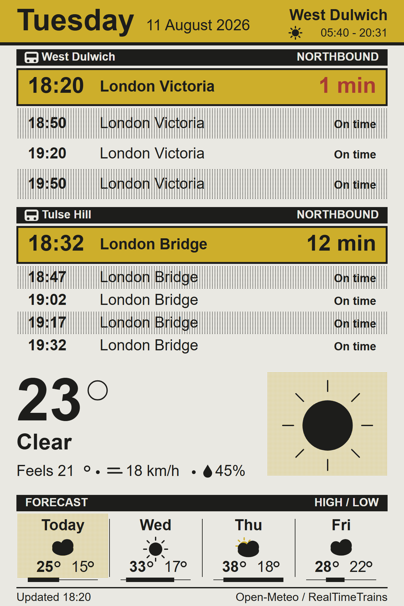
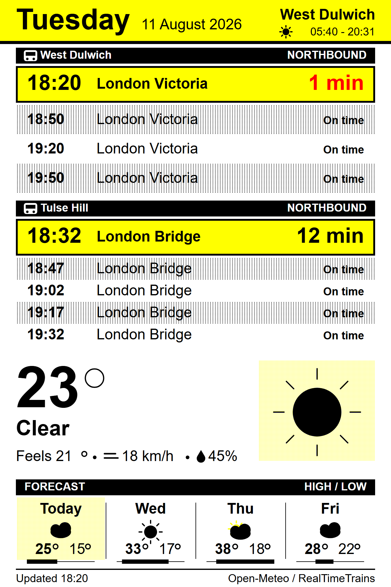

# E-Ink Weather & Train Board

A wall-mounted departure board and weather display for a **Good Display GDEM102F91** —
10.2", 960×640, four-colour (black / white / red / yellow) e-paper — driven by an ESP32.

It shows the next northbound trains from **two** stations, current conditions, and a
four-day forecast. It wakes on a clock-aligned grid, draws once, and sleeps.

<p align="center">
  
</p>

<p align="center"><em>Real data, 18:20 on 11 August 2026. Rendered by
<code>preview/board-preview.html</code>, which mirrors <code>src/render.cpp</code>
constant-for-constant — see <a href="#previewing-without-hardware">Previewing without
hardware</a>.</em></p>

## Status

**Working on hardware.** Boots, fetches live weather and live northbound departures for
West Dulwich and Tulse Hill, draws, and deep-sleeps to a 10-minute grid. A full
four-colour refresh measures **22.3 s**. Build is 24.5% RAM / 76.8% flash.

## Hardware

| Part | Detail |
|---|---|
| Panel | Good Display GDEM102F91 — 10.2", 960×640, 4-colour, SPI |
| Controller | SSD2677 |
| Board | Good Display **ESP32-L(C02)** evaluation kit (ESP32-L + DESPI-C02 adapter) |
| MCU | ESP32-WROOM-32D |
| USB bridge | CH340 |

Mounted **portrait**, so the drawing surface is 640 wide × 960 tall.

## Quick start

```powershell
pip install platformio
git clone https://github.com/Lazysusan01/eink-departure-board.git
cd eink-departure-board
copy .env.example .env      # then fill it in
pio run -t upload
pio device monitor
```

### Configuration

Credentials live in a gitignored **`.env`** at the project root. `scripts/load_env.py`
turns every entry into a `-D` define before compilation, and every value in
`include/config.h` is `#ifndef`-guarded — so `.env` wins where it defines something and
the tracked defaults apply where it doesn't. A partial `.env` is a valid state, not a
build error.

```ini
WIFI_SSID="your network"
WIFI_PASSWORD="your password"
RTT_REFRESH_TOKEN="ey..."
```

An ESP32 has no filesystem to read secrets from at boot, so configuration is unavoidably
compile-time. This split is what keeps that from meaning *"in the repository"* —
`config.h` holds placeholders and is safe to commit; `.env` never is. `load_env.py` prints
key names only, never values, so the token stays out of build logs too.

**2.4 GHz only** — the ESP32-WROOM-32D has no 5 GHz radio, so a router that merges both
bands under one SSID may need the 2.4 GHz band split out.

Everything else is in `include/config.h` and none of it is secret: location
(`WEATHER_LAT` / `WEATHER_LON` / `WEATHER_PLACE`), the two stations, refresh interval,
quiet hours, and `DISPLAY_ROTATION` (flip between `1` and `3` if the board comes up upside
down).

## Bring-up: four things that will stop you dead

Every one of these presents as "blank screen" or "won't program", and none is guessable
from the code. In the order you will hit them.

### 1. GPIO12 straps the flash voltage — you must burn an eFuse

The ESP32-L wires the panel's **RES** line to **GPIO12**, which is also the ESP32's MTDI
strapping pin: high at reset selects a **1.8 V** flash regulator. RES is active-low, so the
panel holds it high, and the board's 3.3 V flash then cannot be read at all. Symptoms:

```
Flash voltage set by a strapping pin to 1.8V
Manufacturer: ff   Device: ffff   Detected flash size: Unknown
```

and on a normal boot, an endless loop of `flash read err, 1000`.

This is **not** avoidable in firmware — the strap is latched before any code runs — and not
avoidable by choosing another pin, because the trace is fixed and Good Display's own sample
code uses GPIO12 too. Their documented "power off, connect panel, power on" workflow does not
help; a cold start latches the strap identically.

The fix is permanent and irreversible:

```powershell
espefuse.py --port COM5 set_flash_voltage 3.3V
```

Safe here because the board's flash *is* a 3.3 V part (`46`/`4016`, 4 MB) — verify that with
`esptool.py flash_id` and the **panel unplugged** before burning. Afterwards esptool reports
`Flash voltage set by eFuse to 3.3V` and the panel can stay connected.

### 2. The ribbon goes in contacts facing **away** from the adapter

The kit manual says "insert the e-paper FPC gold finger upward". For this panel on this
adapter that is **wrong** — contacts must face *away* from the DESPI-C02 board. Backwards,
the ribbon still makes *some* contact (enough to pull RES high and change the flash strap),
which is why it looks plausibly connected while nothing works.

Tell them apart by measuring rather than looking: with the wrong orientation, BUSY is driven
by nothing; with the right one it goes low on a reset pulse and high ~8 ms later. The
`selftest` build prints exactly this.

### 3. The DESPI-C02 RESE switch must be on the higher value

The adapter's DIP switch selects the RESE resistor: `0.47 Ω` for UC-series controllers, the
other position (silkscreened `2.2`, called 3 Ω in the manual) for **SSD-series and all
four-colour panels**. The GDEM102F91 is both. Wrong setting = the panel won't refresh properly.

### 4. Never parse JSON off `http.getStream()`

Both APIs respond with `Transfer-Encoding: chunked`. `HTTPClient::getStream()` hands back the
**raw socket**, so the chunk-size lines are still embedded in it. ArduinoJson parses those as
garbage and returns an **empty document while reporting success** — so the fetch fails
silently, every cycle, with nothing in the log. Use `getString()`, which de-chunks.
`ReadBufferingStream` does *not* fix this; it isn't a buffering problem.

### Pin mapping (ESP32-L + DESPI-C02)

From GxEPD2's own `examples/.../GxEPD2_wiring_examples.h`, confirmed against Good Display's
`ESP32epdx` sample — **not** the Waveshare ESP32 driver board mapping, which is different and
wrong for this kit:

| Signal | GPIO |
|---|---|
| BUSY | 13 |
| RES | 12 ← the strapping pin, see above |
| D/C | 14 |
| CS | 27 |
| SCK | 18 (VSPI default) |
| SDI | 23 (VSPI default) |

These are the ESP32's default VSPI pins, so **no `SPIClass` re-mapping is needed**. Other
board variants live in `include/board_pins.h` behind a `#define`.

### The bring-up build

```powershell
pio run -e selftest -t upload
```

Skips WiFi entirely and paints a colour-bar / halftone / orientation test, then the full
layout with fixed data. It also probes BUSY and scans every GPIO for externally driven pins.
Use it to separate display faults from network faults — they present identically as a blank
screen, and separating them is most of the work.

### The driver class

**GxEPD2 has no class for the GDEM102F91.** The board uses `GxEPD2_1160c_GDEY116F51`
instead — the 11.6" panel from the same family, which has the same 960×640 grid, the same
SSD2677 controller, and an init sequence that sends resolution via the `TRES` command derived
from `WIDTH`/`HEIGHT` rather than hardcoding panel geometry. 10.2" and 11.6" here are the same
pixel grid at different physical sizes.

This substitution is **proven on hardware**, not assumed.

## Two stations, one direction

The trains panel is split between **two stations**, each with its own block. They're
different walks from the flat, so merging them into one time-sorted list would be
misleading — "the next train" isn't a meaningful idea when catching it means choosing which
way to leave the house.

The API has **no direction field**, so "northbound" is expressed as a list of destinations,
`|`-separated and matched case-insensitively:

| Station | Northbound filter | Why |
|---|---|---|
| `WDU` West Dulwich | `London Victoria` | Everything towards town terminates there |
| `TUH` Tulse Hill | `Bedford\|London Bridge\|St Pancras\|Blackfriars\|Luton\|Kentish Town` | Thameslink runs through to Bedford/St Pancras; Southern terminates at London Bridge |

Southbound at Tulse Hill — Sutton, Selhurst, East Croydon, Norwood Junction — is excluded by
omission. Both lists were derived from real six-hour samples of the live API rather than
timetable guesswork, but they are a **judgement call**: an unusual terminus (engineering
diversions, late-night short workings) gets filtered out rather than shown. Leave a filter
empty to show every train in both directions.

`MAX_DEPARTURES` is **per station** (5: one emphasised, four rows) — about as many as a
120-minute window actually returns for a station like Tulse Hill. West Dulwich is
half-hourly, so it often fills four of the five and the rows simply share the height between
them. The hero keeps a fixed height and whatever follows divides the rest, so late at night
the rows get taller rather than the block shrinking and moving everything under it.

## Data sources

- **Weather** — [Open-Meteo](https://open-meteo.com/). No API key, no account. Returns local
  timestamps when `timezone=auto`, so nothing on-device does offset arithmetic.
- **Trains** — [RealTimeTrains **v2**](https://realtimetrains.github.io/api-specification/),
  at `data.rtt.io`. **Bearer tokens, not HTTP Basic**, and two calls per fetch: the long-life
  *refresh* token buys a short-life access token from `/api/get_access_token`, which then
  authorises `/gb-nr/location?code=…`. Both stations share one token.

  This replaced the old `api.rtt.io` v1 API, which used HTTP Basic with a username and
  password. v1 credentials return **401** against v2 — different host, different auth scheme,
  different response shape. If departures 401 while everything else works, that's why.

  v2's location endpoint carries no **platform** number, so that field stays empty and the row
  renderer omits the badge rather than printing a guess.

Both responses are parsed through an **ArduinoJson filter**, so only the dozen fields actually
drawn are ever materialised — a departure board is a long document and the ESP32 is holding an
open TLS session at the same time. Both bodies are read with `getString()`; see bring-up note
4, which is not optional.

## How it behaves

**One pass per wake**: connect → fetch → draw → deep sleep. There is no `loop()` work.

A full four-colour refresh takes ~22 s and visibly cycles the panel through its colour planes,
so the board is deliberately a slow appliance:

- `REFRESH_MINUTES` (default **10**) between refreshes, **aligned to the clock** so updates
  land on tidy times instead of drifting by however long each fetch took. At 10 minutes the
  panel is strobing about 4% of the time, which is tolerable on a living-room wall.
- `RETRY_MINUTES` (default 3) after a failed fetch.
- **Quiet hours** (default 23:00–06:00): no refreshes overnight. E-paper holds its last image
  at zero power, so the board still reads correctly — it just stops flashing at you.

**Failure is partial, not total.** The last good board is kept in `RTC_DATA_ATTR` memory,
which survives deep sleep. If only the train API is down, the weather half still updates and
the trains fall back to the previous values; the footer marks the board `NOT REFRESHED` in
red. Losing WiFi entirely redraws the last good board rather than blanking the wall. A single
station failing never costs you the other one.

## Design notes

**Memory.** A full 960×640 four-colour framebuffer is 150 KB at 2 bits per pixel, which does
not fit on an ESP32 alongside WiFi and TLS. GxEPD2 draws in horizontal bands instead;
`MAX_DISPLAY_BUFFER_SIZE` in `platformio.ini` caps that at 32 KB (≈5 passes). This is why
`renderBoard()` must be a **pure function of `BoardData`** — it is called once per band, and
anything read from the clock mid-render could tick over between bands and leave two pages
disagreeing across a seam. The date strings are stamped into `BoardData` before drawing starts
for exactly this reason.

**Colour.** The panel has four inks and the temptation is to use all of them everywhere. The
rule this board follows (`include/palette.h`):

- **Black** — everything structural, and every value you actually read
- **Red** — exceptions only: delays, cancellations, heavy rain, high rain probability
- **Yellow** — accents and fields; never load-bearing on its own, because yellow on white is
  the weakest contrast pair the panel has

Cancellations get **both** red text and a strike-through, so they survive being photographed
or viewed at an angle where the red plane washes out.

What the firmware writes and what the panel prints are not the same thing. The code asks for
`0xF800` and `0xFFE0`; Spectra pigment renders a muted brick and a mustard, and "white" is a
warm grey:

| As printed (Spectra pigment) | As coded (RGB565) |
|---|---|
|  |  |

**Halftones** are the trick that makes four inks feel like more than four: a yellow/white
checkerboard reads as pale gold, black/white as grey, without inventing a colour the panel
cannot print. The lattices are keyed to **absolute screen coordinates**, never to the region
being filled — otherwise the pattern shifts between GxEPD2's horizontal bands and leaves a
visible seam mid-region.

**Icons** are drawn with GFX primitives (`src/icons.cpp`), not stored as bitmaps: the same
symbol is needed at very different sizes — a 158 px hero against a 42 px forecast column — and
one vector routine covers both without shipping two sets of image arrays in flash. The clouds
use an inflate-in-black-then-fill-in-white trick to get an even outline without stroking each
overlapping arc and erasing the seams.

**No degree glyph.** The bundled Adafruit FreeSans fonts only cover ASCII `0x20–0x7E`, so `°`
cannot be printed. `drawDegreeRing()` draws it as a ring scaled to the text it follows.

**TLS.** Both fetches use `client.setInsecure()` — the ESP32 carries no root certificate store.
For a read-only board on a home LAN that is a reasonable trade; if you'd rather not, pin the CA
with `client.setCACert()` for each host.

## Layout budget

| Panel | y | height |
|---|---|---|
| Masthead | 0 | 72 |
| **West Dulwich** | 78 | 244 |
| **Tulse Hill** | 328 | 244 |
| Now | 578 | 200 |
| Forecast | 778 | 150 |
| Footer | 928 | 32 |

Departures sit directly under the masthead rather than at the bottom: the train is the only
thing on this board anyone acts on — the weather you glance at, the 22:09 you either catch or
miss — so it gets the top half, where the eye lands and where it reads from across the room.
The masthead is the one panel nobody reads twice, so it pays the smallest rent per pixel.

There used to be an hourly temperature curve at y=608 ("next 10 hours", 170 px). It went to
pay for the second station: two blocks sharing 336 px gave each one an emphasised departure
and two rows, under an hour of look-ahead when the fetch already asks the API for two. At
244 px each they hold a hero and four rows.

Removing it also removed the `&hourly=` block from the Open-Meteo request, which is worth more
than the pixels: those arrays are 96 floats per variable against 4 for a daily one. The
response went from several kilobytes to **1151 bytes**, taking the heap pressure off a parse
that used to intermittently truncate when it landed next to an open TLS session.

Constants live at the top of `src/render.cpp`.

## Previewing without hardware

`preview/board-preview.html` is a standalone page that redraws the board as SVG using the
**same constants, same order and same helpers** as `src/render.cpp` — so if the two disagree,
one of them is a bug rather than a translation. Open it in a browser; the toggle switches
between real Spectra pigment and nominal RGB565.

It's exact on positions, heights and halftones, and *approximate* on text metrics: it
estimates Adafruit_GFX glyph widths rather than reproducing the font tables, so right-aligned
elements can sit a few pixels off where the panel puts them.

The images in this README are exported from it (`docs/board-*.svg`, rasterised to
`docs/board-*.png`). A 22-second refresh makes iterating on layout directly against the panel
slow enough to be worth avoiding.

## Files

```
include/
  config.h        placeholders + everything non-secret; .env overrides it
  board_pins.h    wiring per board variant
  palette.h       the four inks and the rule for using them
  model.h         BoardData and friends (POD, so they survive deep sleep)
  weather.h  trains.h  render.h  icons.h  selftest.h
src/
  main.cpp        wake → fetch → draw → sleep
  weather.cpp     Open-Meteo
  trains.cpp      RealTimeTrains v2
  render.cpp      layout
  icons.cpp       vector weather icons
  selftest.cpp    the no-network bring-up screen
scripts/
  load_env.py     .env → -D defines, pre-build
preview/
  board-preview.html
docs/
  board-spectra.svg / .png   the images above
  board-rgb565.svg  / .png
```

Two PlatformIO environments: `esp32dev` (the real thing) and `selftest` (no WiFi).

## Ideas not built

- Battery + voltage reading in the footer (the panel's zero-idle-power suits it)
- A "leave by" line that subtracts your walk time from the next departure
- Tube and bus via TfL's unified API
- Calendar events from an ICS feed

## Licence

MIT — see [LICENSE](LICENSE).
